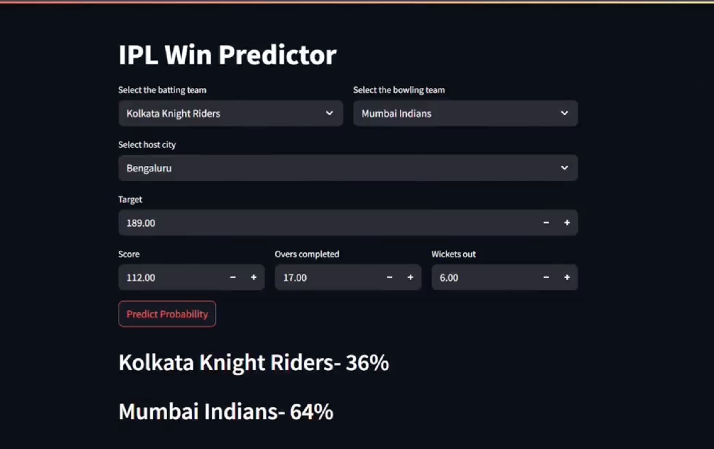

# 🏏 IPL Match Win Probability Predictor

A machine learning project that predicts the **real-time win probability** of IPL teams 
during the 2nd innings, based on match situation like current score, balls left, 
wickets in hand, and required run rate.

## 📊 Demo
  <!-- add a screenshot -->

## 🎯 How It Works
- Trained on IPL data from **2008–2019** (756 matches, 150,000+ deliveries)
- Uses **Logistic Regression** with One-Hot Encoding for teams and cities
- Predicts win/lose probability ball-by-ball during the 2nd innings
- Achieved **~80.3% accuracy** on test data

## 🗂️ Project Structure
ipl-win-predictor/
├── data/
│   ├── matches.csv        # Match-level data (756 matches)
│   └── deliveries.csv     # Ball-by-ball data (150k+ rows)
├── IPL_Winning_Predictor.ipynb  # Full analysis + model training
├── pipe.pkl               # Trained model pipeline (optional)
├── requirements.txt
└── README.md

## 🧠 Features Used
| Feature | Description |
|---|---|
| batting_team | Team currently batting |
| bowling_team | Fielding team |
| city | Match venue city |
| runs_left | Runs needed to win |
| balls_left | Balls remaining |
| wickets | Wickets in hand |
| crr | Current run rate |
| rrr | Required run rate |

## 🚀 Run Locally
git clone https://github.com/Heetgohel/IPL-Team-Win-Prediction
cd IPL-Team-Win-Prediction
pip install -r requirements.txt
jupyter notebook IPL_Winning_Predictor.ipynb

## 📦 Tech Stack
- Python 3.8
- Pandas, NumPy
- Scikit-learn (Logistic Regression, Pipeline, ColumnTransformer)
- Matplotlib

## 📈 Results
The model achieves **80.3% accuracy**. Win probability updates after each over 
and responds correctly to wickets falling and scoring acceleration.
```

---

## 🟡 Nice to Have — Polish

**3. Add a `.gitignore` file** to avoid accidentally committing junk:
```
# .gitignore
*.pyc
__pycache__/
.ipynb_checkpoints/
*.pkl
.DS_Store
```

**4. Add a screenshot/chart** — take a screenshot of the win probability chart from your notebook and put it in an `assets/` folder. Link it in the README. This is the single biggest visual upgrade.

**5. Check `requirements.txt`** — make sure it has exact versions:
```
pandas==1.2.4
numpy==1.20.1
scikit-learn==0.24.1
matplotlib==3.3.4
